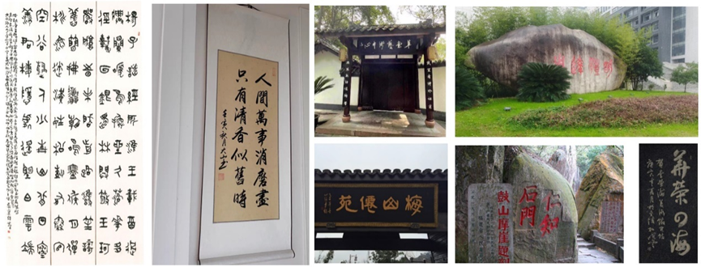

# HUSAM-SinoCDCS
HUSAM-SinoCDCS dataset

**Table 1** Distribution of ancient Chinese character forms across different scene types

| stone  inscriptions | calligraphy | couplets | total |
| ------------------- | ----------- | -------- | ----- |
| 560                 | 744         | 855      | 2,159 |
